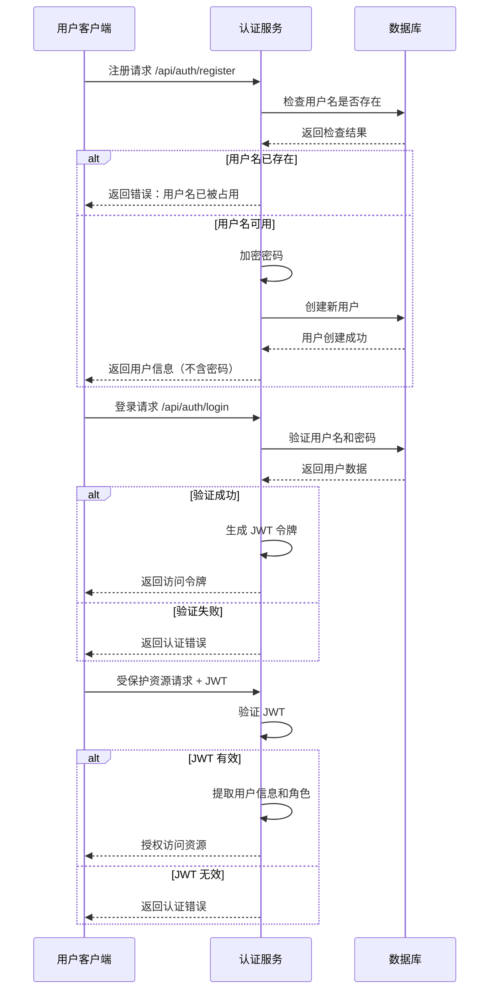
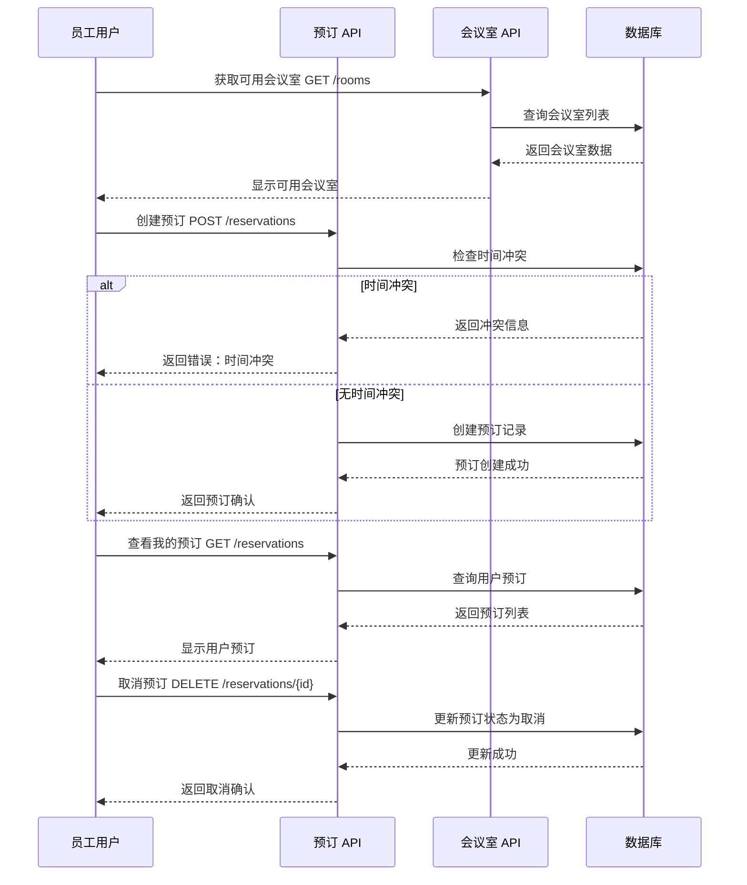
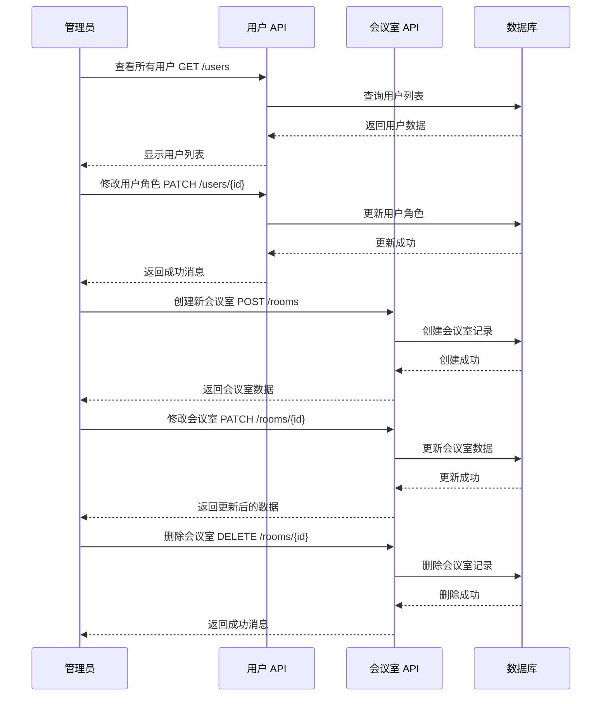
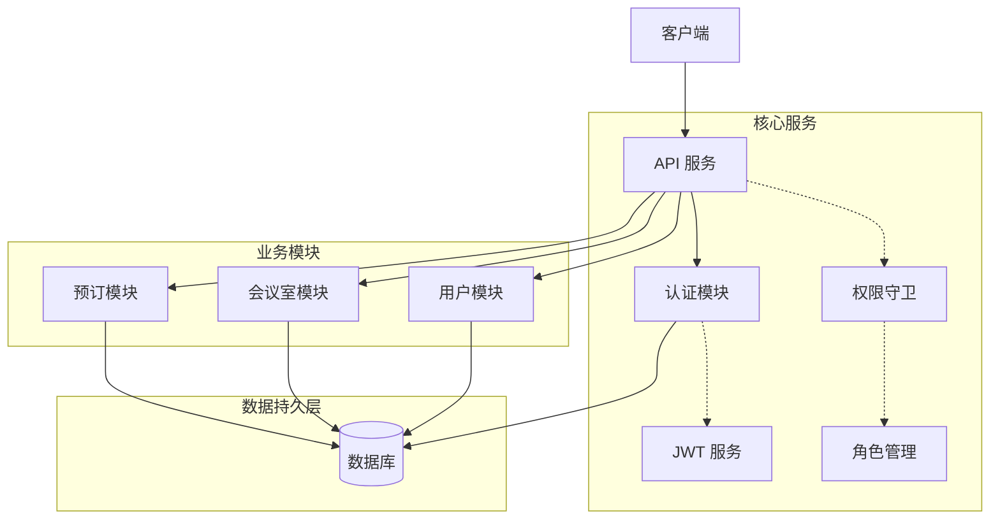

# 会议室预订系统 API 流程图

本文档提供了会议室预订系统的主要工作流程图，帮助开发者和用户理解系统交互过程。

## 目录
- [用户认证流程](#用户认证流程)
- [会议室预订流程](#会议室预订流程)
- [管理员工作流程](#管理员工作流程)
- [系统架构概览](#系统架构概览)

## 用户认证流程

下图展示了用户注册、登录和认证流程：

## 会议室预订流程

下图展示了会议室预订的完整流程：

## 管理员工作流程

下图展示了管理员管理会议室和用户的流程：

## 系统架构概览

下图展示了系统的整体架构和组件关系：

